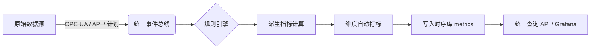

# 工业数字底座：统一多维时序指标体系设计与实现指南

> 本文系统整理了构建可扩展、高性能、配置化工业软件数字底座的完整方法论，涵盖**统一资产建模、多源数据融合、声明式规则引擎、时序存储设计、灵活查询支持及弹性扩展机制**。适用于能耗、工单、OEE、环保等垂直场景，支撑未来复杂分析与快速行业落地。

---

## 目录

- [工业数字底座：统一多维时序指标体系设计与实现指南](#工业数字底座统一多维时序指标体系设计与实现指南)
  - [目录](#目录)
  - [一、核心目标与业务场景](#一核心目标与业务场景)
    - [业务需求](#业务需求)
    - [平台目标](#平台目标)
  - [二、整体架构设计](#二整体架构设计)
  - [三、数据模型设计](#三数据模型设计)
    - [3.1 资产模型（关系型）](#31-资产模型关系型)
    - [3.2 时序指标模型（InfluxDB）](#32-时序指标模型influxdb)
      - [统一 Measurement：`metrics`](#统一-measurementmetrics)
      - [Line Protocol 示例：](#line-protocol-示例)
  - [四、规则引擎：声明式配置驱动](#四规则引擎声明式配置驱动)
    - [4.1 YAML 插件规范](#41-yaml-插件规范)
      - [电能统计（采样型）](#电能统计采样型)
      - [工单统计（事件型）](#工单统计事件型)
    - [4.2 内置聚合类型（平台预实现）](#42-内置聚合类型平台预实现)
  - [五、关键技术实现细节](#五关键技术实现细节)
    - [5.1 电能增量计算（状态管理）](#51-电能增量计算状态管理)
    - [5.2 工单计数与空窗口处理](#52-工单计数与空窗口处理)
    - [5.3 维度自动打标](#53-维度自动打标)
  - [六、查询与分析能力](#六查询与分析能力)
    - [6.1 InfluxQL 查询示例](#61-influxql-查询示例)
      - [能耗按楼层对比（2026-01-20）](#能耗按楼层对比2026-01-20)
      - [CNC 设备工单完成率趋势](#cnc-设备工单完成率趋势)
    - [6.2 支持的分析场景](#62-支持的分析场景)
  - [七、扩展性与未来演进](#七扩展性与未来演进)
    - [7.1 新增垂直场景（零代码）](#71-新增垂直场景零代码)
    - [7.2 性能保障策略](#72-性能保障策略)
    - [7.3 技术栈演进建议](#73-技术栈演进建议)
  - [八、最佳实践总结](#八最佳实践总结)
  - [九、附录：InfluxDB 1.8 实操示例](#九附录influxdb-18-实操示例)
    - [9.1 数据写入（INSERT）](#91-数据写入insert)
    - [9.2 查询验证](#92-查询验证)

---

## 一、核心目标与业务场景

### 业务需求
- **电能统计**：按设备、楼层、子系统统计日/小时用电量，支持趋势对比。
- **工单统计**：按设备类型、工单状态、负责人统计完成数、完成率，支持多维下钻。
- **未来扩展**：快速支持环保排放、备件消耗、质量缺陷等新指标。

### 平台目标
✅ **统一建模**：设备、系统、楼层等通过资产模型集中管理  
✅ **多源融合**：PLC 实时数据、人工工单、报警事件、计划任务统一接入  
✅ **灵活分析**：任意时间粒度 + 任意业务维度组合的过滤、分组、对比、趋势  
✅ **弹性扩展**：新增指标只需配置，无需开发编码  
✅ **高性能**：复杂查询毫秒级响应，支撑大屏、BI、移动端

---

## 二、整体架构设计



| 层级 | 职责 | 技术建议 |
|------|------|--------|
| **统一接入层** | 将异构数据转为标准化事件 | Kafka / NATS + 边缘采集器（如 Fledge） |
| **规则引擎** | 解析 YAML，执行聚合逻辑 | Flink（流式）或 Quartz（批式） |
| **维度打标器** | 关联资产模型，注入业务 tag | PostgreSQL + Redis 缓存 |
| **时序存储** | 存储标准化指标 | InfluxDB 1.8 / TDengine |
| **查询服务** | 提供统一 API | 自研（转 InfluxQL）或 Grafana 直连 |

---

## 三、数据模型设计

### 3.1 资产模型（关系型）

```sql
-- 核心资产表
CREATE TABLE assets (
    id                TEXT PRIMARY KEY,
    name              TEXT NOT NULL,
    type              TEXT NOT NULL,          -- 设备/电表/产线
    tenant_id         TEXT NOT NULL,
    
    -- 显式高频维度（用于高效查询）
    site_id           TEXT,
    building          TEXT,
    floor             TEXT,
    department        TEXT,
    production_line   TEXT,
    
    parent_id         TEXT REFERENCES assets(id),  -- 树形结构
    custom_properties JSONB                       -- 扩展属性
);

-- 可选：标签表（支持多归属）
CREATE TABLE asset_tags (
    asset_id    TEXT NOT NULL REFERENCES assets(id),
    tag_key     TEXT NOT NULL,
    tag_value   TEXT NOT NULL,
    PRIMARY KEY (asset_id, tag_key, tag_value)
);
```

> ✅ **原则**：80% 高频维度显式化，20% 灵活维度用 JSON 或标签

---

### 3.2 时序指标模型（InfluxDB）

#### 统一 Measurement：`metrics`

- **Tags（维度，可索引）**：
  - `metric_type`：指标类型（如 `hourly_energy_kwh`）
  - 业务维度：`floor`, `system`, `equipment_type`, `status` 等（动态）
  - `tenant_id`：租户隔离

- **Fields（数值，不可索引）**：
  - `value`：主指标值（float/int）
  - （可选）`count`, `sum`, `max` 等多字段

#### Line Protocol 示例：
```text
metrics,metric_type=hourly_energy_kwh,floor=2F,system=injection value=15.5 1705845600000000000
metrics,metric_type=hourly_workorder_count,equipment_type=CNC,status=completed value=3 1705845600000000000
```

> ✅ **优势**：任意维度组合过滤/分组高效；无 schema 变更成本

---

## 四、规则引擎：声明式配置驱动

### 4.1 YAML 插件规范

#### 电能统计（采样型）
```yaml
derived_metrics:
  - id: hourly_energy_kwh
    source_event: telemetry.raw
    filter:
      propertyKey: energy_kwh
    aggregation:
      type: delta          # 增量 = 当前值 - 上次值
      time_window: 1h
    dimensions:
      - from_asset_property: floor
      - from_asset_property: production_line
    output:
      metric_type: hourly_energy_kwh
```

#### 工单统计（事件型）
```yaml
derived_metrics:
  - id: hourly_completed_workorders
    source_event: workorder.completed
    aggregation:
      type: count          # 每小时事件计数
      time_window: 1h
    dimensions:
      - from_related_asset: equipment_type
      - static: { status: completed }
    output:
      metric_type: hourly_workorder_count
```

### 4.2 内置聚合类型（平台预实现）

| 类型 | 适用场景 | 状态需求 |
|------|--------|--------|
| `delta` | 电能、水表等累计量 | 保存 last_value |
| `count` | 工单、报警次数 | 窗口计数 |
| `sum` / `avg` | 多点聚合（如区域总功率） | 累加/平均 |
| `last` | 最新状态快照 | 保存最新值 |
| `rate` | 变化速率（value/time） | 保存 last_value + timestamp |

> ✅ 用户只需声明 `type`，平台自动选择执行逻辑

---

## 五、关键技术实现细节

### 5.1 电能增量计算（状态管理）

- **挑战**：从累计值计算小时增量（需记住上一次值）
- **推荐方案**：Flink `KeyedProcessFunction` + 托管状态
  - 每个 `assetId` 独立状态
  - RocksDB + Checkpoint 保证 Exactly-once 与故障恢复
- **轻量替代**（<1000 设备）：
  - 写入前查 InfluxDB 最新值
  - Redis 缓存 `assetId → last_value`

### 5.2 工单计数与空窗口处理

- **挑战**：某小时无工单事件 → 需输出 `value=0`
- **解决方案**：
  1. **Flink 定时器**：每窗口结束强制输出（含0）
  2. **查询层补零**：InfluxQL `fill(0)`
  3. **（可选）预注册维度**：主动写零确保所有组合存在
- **YAML 无需特殊配置**：`time_window: 1h` 隐含“每窗口必输出”

### 5.3 维度自动打标

- **流程**：
  1. 从事件获取 `assetId` 或 `equipmentId`
  2. 查询 PostgreSQL 资产表，提取 `floor`, `equipment_type` 等
  3. 注入为 InfluxDB tags
- **优化**：热点资产缓存（Redis），降低 DB 压力

---

## 六、查询与分析能力

### 6.1 InfluxQL 查询示例

#### 能耗按楼层对比（2026-01-20）
```sql
SELECT sum(value) 
FROM metrics 
WHERE metric_type = 'hourly_energy_kwh' 
  AND time >= '2026-01-20T00:00:00Z' 
  AND time < '2026-01-21T00:00:00Z'
GROUP BY floor, time(1h) fill(0);
```

#### CNC 设备工单完成率趋势
```sql
SELECT sum(value) 
FROM metrics 
WHERE metric_type = 'hourly_workorder_count' 
  AND equipment_type = 'CNC'
  AND status = 'completed'
GROUP BY time(1d) fill(0);
```

### 6.2 支持的分析场景
- **多维下钻**：总能耗 → 楼层 → 产线 → 设备
- **横向对比**：2F vs 3F 用电趋势
- **同比/环比**：本月 vs 上月工单量
- **KPI 仪表盘**：OEE、MTTR、能耗强度等

---

## 七、扩展性与未来演进

### 7.1 新增垂直场景（零代码）
- **步骤**：部署新 YAML 插件（如 `emission-metrics.yaml`）
- **效果**：自动监听新事件、计算、打标、入库
- **示例**：
  - 环保：`daily_co2_tons`
  - 质量：`hourly_defect_rate`
  - 备件：`monthly_spare_consumption`

### 7.2 性能保障策略
- **Series 基数控制**：避免高基数 tag（如 `user_id`）
- **冷热分离**：热数据 SSD，冷数据降采样归档
- **物化视图**：高频查询预聚合（如每日各楼层能耗）

### 7.3 技术栈演进建议
- **InfluxDB 1.x → 2.x / TDengine**：更强压缩比与 SQL 支持
- **Flink → RisingWave**：云原生流数据库简化架构
- **Grafana + Tempo**：指标 + 日志 + 链路追踪一体化

---

## 八、最佳实践总结

| 原则 | 建议 |
|------|------|
| **资产建模** | 核心维度显式化，扩展属性用 JSON/标签 |
| **指标存储** | 统一 `metrics` measurement + 动态 tags |
| **规则配置** | YAML 声明聚合类型 + 维度来源 |
| **执行引擎** | Flink 流处理（实时） + 批处理（兜底） |
| **空值处理** | 事件型指标必须补零（窗口输出 + fill(0)） |
| **查询优化** | 时间范围必加，维度组合 ≤ 3 个 |

> ✅ **最终效果**：  
> **实施人员通过配置即可上线新指标，开发者专注平台引擎，业务人员自由探索数据。**

---

## 九、附录：InfluxDB 1.8 实操示例

### 9.1 数据写入（INSERT）

```sql
-- 连接数据库
influx -database test1

-- 插入电能数据
INSERT metrics,metric_type=hourly_energy_kwh,floor=2F,system=injection value=15.5 1705845600000000000

-- 插入工单数据
INSERT metrics,metric_type=hourly_workorder_count,equipment_type=CNC,status=completed value=3 1705845600000000000
```

> ⚠️ 注意：InfluxDB Shell 中必须用 `INSERT`，不能直接粘贴 Line Protocol

### 9.2 查询验证

```sql
-- 查看所有数据
SELECT * FROM metrics;

-- 按 floor 分组求和
SELECT sum(value) FROM metrics WHERE metric_type='hourly_energy_kwh' GROUP BY floor;

-- 补零查询（关键！）
SELECT sum(value) FROM metrics 
WHERE metric_type='hourly_workorder_count' 
GROUP BY time(1h), equipment_type fill(0);
```

---

*文档版本：1.0 | 更新日期：2026-01-26*  
*作者：Qwen | 场景：工业数字底座设计*